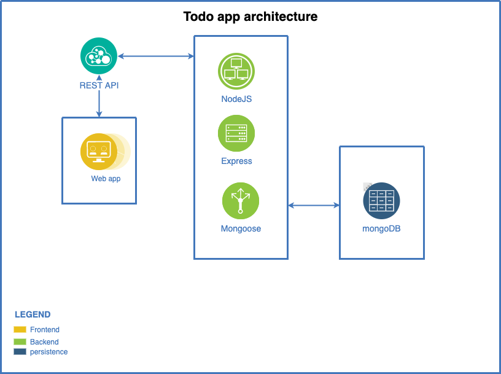

# node-todo-app
Todo App with nodejs, express, mongoose and mongoDB.

## Project architecture

## Prerequisites

[NodeJs](https://nodejs.org/download/), [MongoDB](https://www.mongodb.com/download-center/community)
after that, download or clone repo, go to repo folder and write in console:
> npm install

> cp sample.env .env
## Start server
1. Set the environment variables on the .env file.
    - PORT=
    - DB_URL=
2. After that, you can start the server
    > npm run dev

## Note

This Web App only works with Chromium-based Browsers:  Google Chrome, The New Microsoft Edge, brave and others.